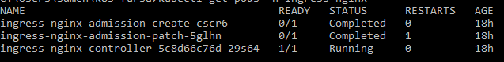

# Kubernetes Ingress
This code creates a deployment and service for the image: yanivomc/spring-music:latest in kubernetes.
__________________________________________

### Deployment for the image: yanivomc/spring-music:latest :
created yaml file named : spring-music-deployment.yaml
with service exposed by specifying a type in the ServiceSpec: ClusterIP (default) - Exposes the Service on an internal IP in the cluster. This type makes the Service only reachable from within the cluster. 
and with port: 8090 , targetPort: 8080.

#### To run the deployment:
```
kubectl apply -f spring-music-deployment.yaml
```

#### In order to check the created pod:
```
kubectl get pods 
```
you'll see :


#### In order to verify the service:
```
kubectl get svc 
```
you'll see :


#### Once Exposed and verified scale pods to 2
```
kubectl scale --replicas=2 deployment spring-music
```
run ``` kubectl get pods ``` to see the 2 pods:
you'll see :


### Install the nginx ingress-controller by the instructions in the link : https://kubernetes.github.io/ingress-nginx/deploy/#docker-desktop
#### after installation run :
```kubectl get pods -n ingress-nginx ```
to check the ingress nginx controller 
you'll see :



### Createed an Ingress yaml file:
created the file with path : /music , by default the host is : localhost and with port 8090

#### run ingress file :
```
kubectl apply -f ingress.yaml
```
you can run ```kubectl get ingress ``` to check the spring-music app in ingress
you'll see :


### You can access the service using the URL: http://127.0.0.1/music
you'll see :


